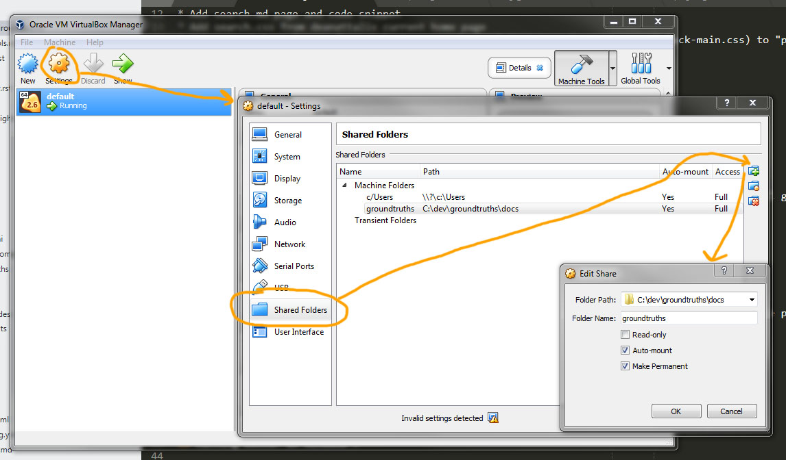

# Ground Truths

This is the source for http://www.groundtruths.net

The template comes from [Dean Attali's Beautiful Jekyll project](http://deanattali.com/beautiful-jekyll). The original readme for that can be found here: https://github.com/daattali/beautiful-jekyll#readme

Here are the modifications I've made on top of his original template (Other than very basic changes in the `_cofig.yml` file):

## Added Google custom search

* Sign up for google custom search (https://cse.google.com). Use the full width option and customise the colours.
* Add search.md page and code snippet
* Add search.css from deanattalis current home page
* Make search-hack layers (search-hack-page and search-hack-base layouts, search-hack-main.css) to "protect" the google search element from having it's tables drawn.

## Add link to tags and search

* Just make an entry in the navbar links in `_config.yml`

## Add custom URL and SSL

* URL needed a CNAME file
* Sign up to cloudflare
* Use this guide: https://blog.cloudflare.com/secure-and-fast-github-pages-with-cloudflare/
* In cloudflare there's an option under crypto section to: "Always use HTTPS". Turning that on will give you the option in the pagerules section to create an "Always use HTTPS" rule.

## Add flickr social link

* Modfication to `_data/SocialNetworks.yaml`

## Move published posts

* Move all the posts to a /posts subfolder when published to make searching them easier (Edited the permalink in `_config.yml`)

## Add contact form

* Use formspree.io and the information in [Deans post](http://disq.us/p/1qmi76b)

## Add favicon

* Use http://convertico.com/ to make an ico file after scaling the png to 64x64 in Photoshop

## Running Docker on Windows 7

* Windows 7 doesn't support the Hypervisor so instead of Docker desktop That normally runs on Windows 10, docker toolbox needs to be used instead (https://docs.docker.com/toolbox/toolbox_install_windows/)
* Install docker toolbox
* Make sure that VMs/virtualisation is enabled in the computers BIOS
* Docker quickstart terminal (from the shortcut docker toolbox creates) warns about virtualisation if it isn't enabled.
* `docker build -t beautiful-jekyll "$PWD"` needs to be run in the directory containing the `Dockerfile` file
* "$PWD" can be replaced with the absolute path to the current directory
* As per https://stackoverflow.com/questions/50540721/docker-toolbox-error-response-from-daemon-invalid-mode-root-docker and https://stackoverflow.com/questions/47091139/docker-mount-project-error-response-from-daemon-on-windows-10 windows 7 directories cannot be mounted directly to docker containers. They must first be mounted in the virtual machine that Docker runs in.
* 
* In this case, `C:\dev\groundtruths\docs` has been mounted to `/groundtruths` in the VM.
* The original docker un command is `docker run -d -p 4000:4000 --name beautiful-jekyll -v "$PWD":/srv/jekyll beautiful-jekyll`
* The -v describes how volumes (on the machine runnign Docker - The VM in this case) are mounted onto the Docker container.
* The command is changed to: `docker run -d -p 4000:4000 --name beautiful-jekyll -v "/groundtruths:/srv/jekyll beautiful-jekyll`
* Run that and the website is available at the normal http://localhost:4000/
